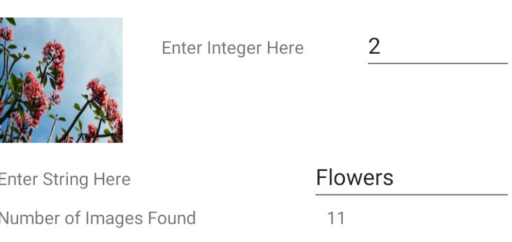
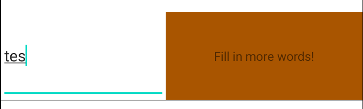
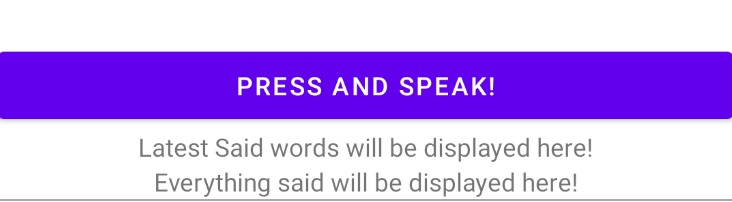
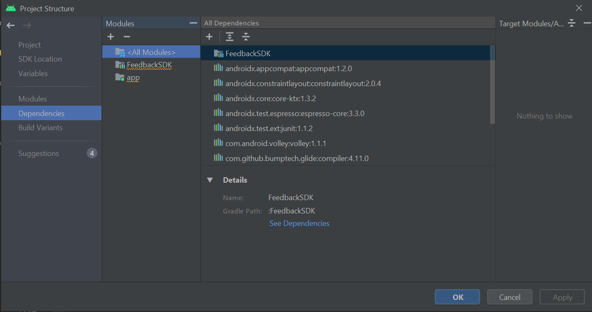
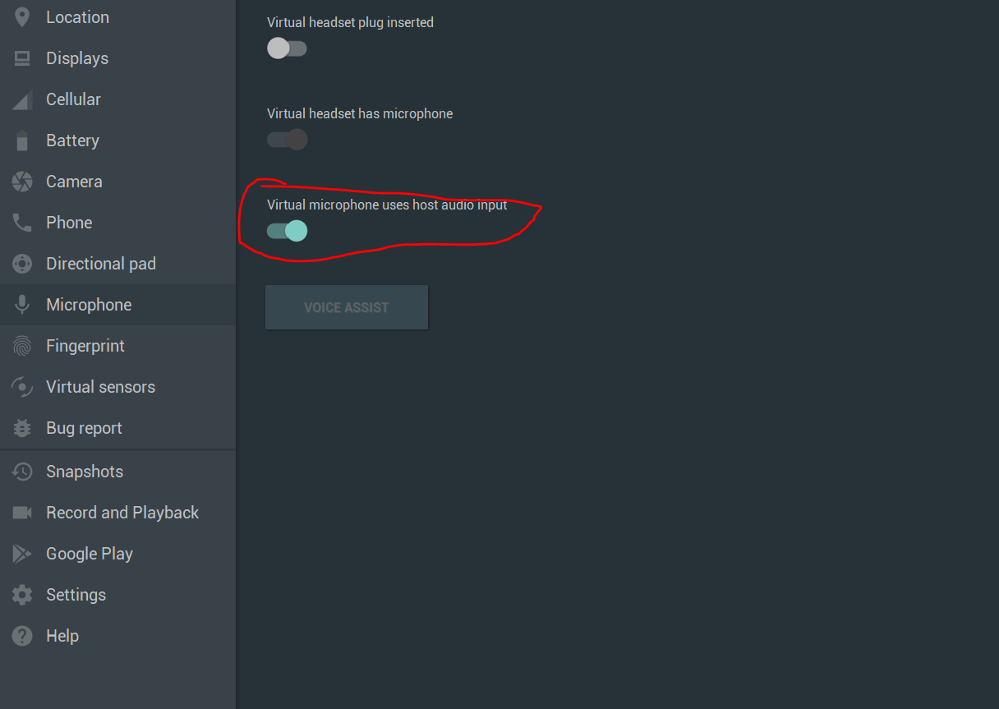

# Feedback_SDK


This file contains tutorials and information about the SDK created in this project.

<!-- toc -->
<details>
  <summary><strong>Table of Contents</strong> (click to expand)</summary>

- [About](#about)
- [Overview](#overview)
- [Installation](#installation)
    - [Import](#import)
    - [Dependency](#dependency)
- [Usage](#usage)
    - [AiImage](#aiimage)
    - [FeedbackView](#feedbackview)
    - [VoiceToTextButton](#voicetotextbutton)
- [Testing](#testing)
    - [Build testing](#build-testing)
    - [UI testing](#ui-testing)
        - [AIIMAGE](#aiimage)
        - [FEEDBACKVIEW](#feedbackview)
        - [VOICETOTEXTBUTTON](#voicetotextbutton)
- [Developed By & Licenses](#developed-by-&-licenses)

    
</details>

<!-- tocstop -->


## About
This project consists of a `SDK` written in Kotlin originally created with the purpose of satisfying the course requirements of the course TDDC73 at Linköpings University. 

The SDK is called `Feedback_SDK` and contains three components that are supposed to help the developer by adding additional "ready to use" and customize components in Android Studio.

These three components include:

* **AiImage** : a ImageView extension that collects and visualizes an image from an incoming text. By searching for image url:s on the internet by index. By default this component uses `splashbase api` but it can be easily changed. See how below.



* **FeedbackView** : is a combined TextEdit and TextView component that analyzes incoming text and visualize a feedback response. The analyze function, feedback text, animations and color-schemes are changeable. 



* **VoiceToTextButton** : is a button component that when clicked detects and translate incoming audio from microphone into text.



In addition to the `SDK` a test-app is included. The test app tests and illustrates all major functionalities within the `SDK`. The gif below illustrates the test-application.


## Overview

This document serves as documentation and tutorials over the SDK. Notice the `Table of content` at the top of the page.

In the gif below I demonstrate all the core functions, I describe the functionalities in the documentation below.


## Installation

This part explains how to install and setup your Android Studio environment to work with the SDK.

To install the core SDK either download/clone this repo and include the `FeedbackSDK` folder and add the code to your project and the SDK as a dependency. By clicking `File->Project Structure...` and then adding the module in the new window.



The other alternative is to build the SDK and include the .jar or .AAC file created by Android Studio.

### Dependency
In order for all functions to work the SDK needs permission to use internet and the microphone. Add these dependencies in your AndroidManifest.xml file.

```XML
<uses-permission android:name="android.permission.INTERNET" />
<uses-permission android:name="android.permission.RECORD_AUDIO" />
```

Also the app needs "unsafe" access to microphone. This can be added by manually changing the apps settings in the "all apps" settings tab in your phone or emulator. Or include these functions in your MainActivity.

```Kotlin
// Help functions for Speech to Text!

    private fun checkPermission() {
        if (Build.VERSION.SDK_INT >= Build.VERSION_CODES.M) {
            ActivityCompat.requestPermissions(this, arrayOf(Manifest.permission.RECORD_AUDIO), 1)
        }
    }

    override fun onRequestPermissionsResult(requestCode: Int, permissions: Array<String?>, grantResults: IntArray) {
        super.onRequestPermissionsResult(requestCode, permissions, grantResults)
        if (requestCode == 1 && grantResults.size > 0) {
            if (grantResults[0] == PackageManager.PERMISSION_GRANTED) Toast.makeText(this, "Permission Granted", Toast.LENGTH_SHORT).show()
        }
    }
```

And add this line in the initiation function of the MainActivity.

```Kotlin
 if (ContextCompat.checkSelfPermission(this, Manifest.permission.RECORD_AUDIO) != PackageManager.PERMISSION_GRANTED) {
            checkPermission()
}
```

This will add the rule for the app from the first time the app run on your phone or emulator.

**NOTE**: Emulator can be a little buggy on some api:s and phones. I recommend testing on a real phone when using the VoiceToTextButton component.
To enable audio input in your emulator, remember to allow it!



### Import

With those dependencies installed the SDK components can now be imported under `com.grebtsew.FeedbackSDK.*`

## Usage
Here I describe how each component can be used and costumized.
A visual representation of all the components can be seen above!

**NOTE**: make sure you installed all dependencies before trying this out!

### AiImage


**Layout**: See required and optional layout variables here!
```XML
<com.grebtsew.feedbackSDK.AIimage
                    android:id="@+id/aiimage"
                    android:layout_width=""
                    android:layout_height=""
                     />
                    <!-- app:Text=""  Optional! Set default text -->
                    <!-- app:ImageIndex=""  Optional! Set image engine search index -->
                    <!-- app:DefaultImage=""  Optional! Set default image url -->
```

**CostumizeCode**: See how we can collect our component, change api, change parser of new api, change test, defaultimage, index and update image im realtime.

```Kotlin

val aiImage = findViewById<com.grebtsew.feedbackSDK.AiImage>(R.id.aiimage)

// apply listener to EditText and update image on changes!
val textField = findViewById<EditText>(R.id.editTextNumberSigned)

textField.addTextChangedListener(object : TextWatcher {
    override fun afterTextChanged(s: Editable?) {
    }

    override fun beforeTextChanged(s: CharSequence?, start: Int, count: Int, after: Int) {
    }

    override fun onTextChanged(s: CharSequence?, start: Int, before: Int, count: Int) {
        aiimage.update(textField.text.toString());
        aiimage.index = s.toString().toInt(); // Change index
        aiimage.update(); // update again
        aiimage.DEFAULT_IMAGE = "https://www.dalalstreetwinners.com/wp-content/uploads/2019/09/Option-strategy-Example.jpg" // change default image
    }
})
       
// Get on image amount change 
aiImage.OnImageAmountChangelistener.observe(this, Observer {
    imageAmountTextView.text = it.toString()
})

// Get on new image updated event
aiImage.OnImageUpdatedlistener.observe(this, Observer {
    Log.i("AIIMAGE", "Image updated!")
})

// Update api
// You must update the parse-function when changing the api!
aiImage.restApiHandlerInterface = object : RestApiHandlerInterface  {
            override fun setRestApiUrl(defaulturl: String): String {
                return ""
            }

            override fun parseResponseToUrl(json: JSONObject, index: Int): Pair<String, Int>?{
                return null
            }

        }
```

### FeedbackView

**Layout**: This component lets you set Colors in string format "#XXXXXX". Start- and EndColor is used to generate colors for each state/level that exists within the component. These levels are set in the code.
```XML
<com.grebtsew.feedbackSDK.FeedbackView
            android:id="@+id/feedbackview"
            android:layout_width=""
            android:layout_height=""
/>
    <!-- app:ColorStart=""  Optional! Set start color -->
    <!-- app:ColorEnd=""  Optional! Set end color -->
    <!-- app:DefaultColor=""  Optional! Set default color -->
```

**CostumizeCode**: The feedbackView is also highly customizable. Here we can change all colors, response text, animations and analyze function of incoming text. The input and feedback Views are also public so a developer can freely use them.

```Kotlin
// No code is needed of feedback to start but to change the listener we can do this
val feedbackview = findViewById<com.grebtsew.feedbackSDK.FeedbackView>(R.id.feedbackview)
var textEdit = integratedFeedbackView.input

 textEdit.addTextChangedListener(object : TextWatcher {
            override fun afterTextChanged(s: Editable?) {
            }

            override fun beforeTextChanged(s: CharSequence?, start: Int, count: Int, after: Int) {
            }

            override fun onTextChanged(s: CharSequence?, start: Int, before: Int, count: Int) {
                // Get Text in Realtime
                textEdit.text.toString()
                
            }
        })

// We can change the analyze function
feedbackview.FEEDBACK_ANALYZE_FUNC = { str: String -> word_size_limit_sample(str) }

// Sample analyze function
fun word_size_limit_sample(str: String): Int {
        // A sample text analysis function for default usages!
        // This function calculates which feedback state we are in.
        // NOTE: return values must be lower than numberOfLevels variable!
        val length = str.length
        if (length == 0) {
            return 0
        }
        if (length < 4) {
            return 1
        }
        if (length < 10) {
            return 2
        } else {
            return 3
        }
    }

// We can change animations, remember to include the FeedbackSDK.Animations ENUM!

var LevelAnimationArray = arrayOf(
        Animations.FLIP,
        Animations.SLIDE,
        Animations.FADE,
        Animations.CUSTOM
    ) // Array of animations

feedbackview.setAnimationArray(LevelAnimationArray)

// For CUSTOM we can add a custom animation function like this
feedbackview.customAnimationFunction = { own_animation_sample() } // If change enum is custom

// Sample animation function
fun own_animation_sample() {
        /*
        * NOTE: animate the "feedback" public component!
        * */

        val bounce = TranslateAnimation(
            0f,  // fromXDelta
            0f,  // toXDelta
            0f,  // fromYDelta
            -100f
        )
        bounce.repeatMode = Animation.REVERSE
        bounce.duration = (1000..2000).random().toLong()
        feedback.startAnimation(bounce)
    }

// Change Text and/or Colors
/**
* This will use entered colors only. 
* To use the automated color generator instead use setColors()!
*/
var LevelColorArray =
        arrayOf("#808080", "#FF0000", "#FFFF00", "#00FF00")
var LevelTextArray = arrayOf(
        "Not initiated!",
        "Fill in more words!",
        "Just a bit more words!",
        "Perfect, your text is acceptable!"
    )
// use null values if you don't want to change something!
feedbackview.setFeedbackData(LevelTextArray,LevelColorArray) 
```

### VoiceToTextButton

**Layout**: See how to use layout component below.

```XML
 <com.grebtsew.feedbackSDK.VoiceToTextButton
            android:id="@+id/voicetotextbutton"
            android:layout_width=""
            android:layout_height=""
            android:gravity="center"
            />
 <!-- app:Language="sv_SE"  Optional! Set language to recognize, default is en_US -->
```

**CostumizeCode**: This component is less customizable but can be very convenient to use in your implementation. See how to get text in realtime execution of your code.

```Kotlin
val voice_to_text_button = findViewById<com.grebtsew.feedbackSDK.VoiceToTextButton>(R.id.voicetotextbutton)
var all_text = ""
var latest_text = ""

voice_to_text_button.listen.observe(this, Observer {
    latest_text = it.toString()
    all_text += " " +latest_text 
})
```

## Testing
This part contains and explains the test created for this SDK.

### Build testing

The code has been build-tested with the command to remove redundant and unused code.

```
gradlew test
```

With the output:

```
BUILD SUCCESSFUL in 20s
72 actionable tasks: 26 executed, 46 up-to-date
```

### UI testing

#### AIIMAGE
These functions are tested for the `AIIMAGE`:

* Simple search 
* Number of images found
* No images found
* Search index change
* Out of bounds index

#### FEEDBACKVIEW
These functions are tested for the `FEEDBACKVIEW`:

* Feedback change on input
* All level/state updates
* Color changes

#### VOICETOTEXTBUTTON
These functions are tested for the `VOICETOTEXTBUTTON`:

* Text updates on button
* Timeout checks

## Developed By & Licenses

[MIT LICENSE](LICENSE)

Created by `Daniel Westberg` Copyright @ 2020.